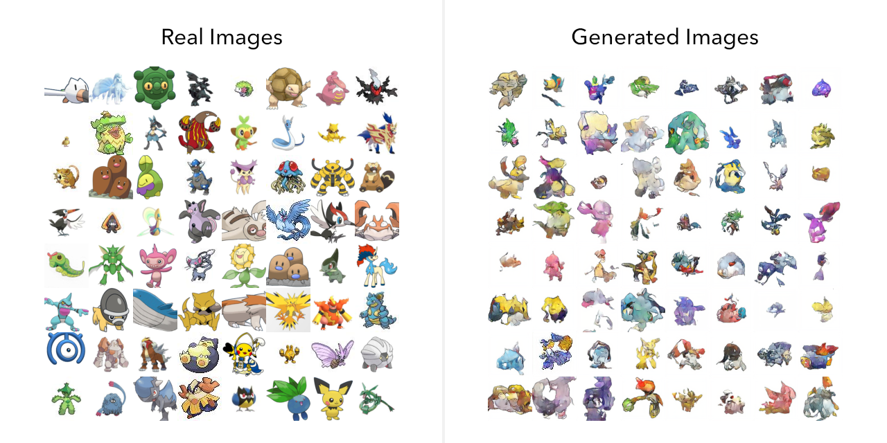
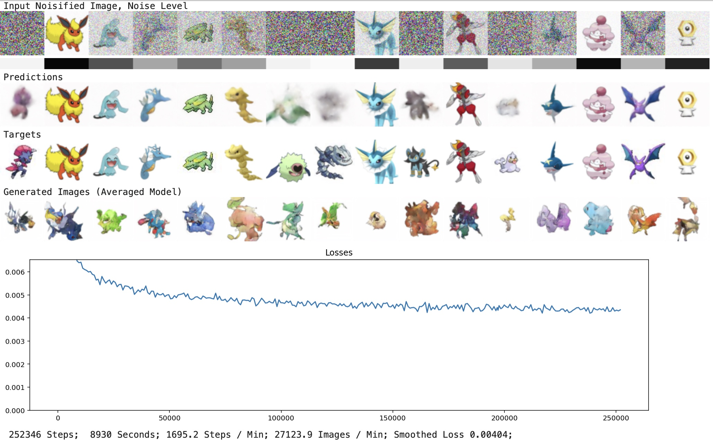
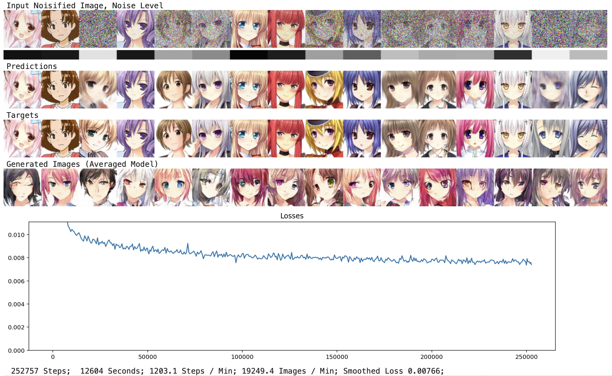

# 🦖 Dino Diffusion: Bare-bones diffusion model code

Dino Diffusion is a short, stand-alone notebook of PyTorch code that [learns to generate images](https://madebyoll.in/posts/dino_diffusion/) based on a training dataset. Dino Diffusion works by training a "noisy-thing-goes-in, denoised-thing-comes-out" neural network ("diffusion model") on the dataset. Dino Diffusion was written to satisfy my own curiosity about how diffusion models work - it is not production-grade software - but if you make anything cool with it, let me know!

Here's what results look for the [huggan Pokémon](https://huggingface.co/datasets/huggan/pokemon) dataset (after a few hours training on one RTX A4000 - about 2x faster than Colab):

Here's what results look like for the [huggan anime-faces](https://huggingface.co/datasets/huggan/anime-faces) dataset:

There are many sophisticated diffusion model training codebases out there already, with lots of clever features. Dino Diffusion is not sophisticated and does not have any clever features.

Notably, Dino Diffusion does not have:

1. Any self-attention layers, or any normalization layers, or any activation functions invented [after 1975](https://link.springer.com/article/10.1007/BF00342633). Dino just uses Conv+ReLU for everything.
3. Any fancy prediction-target setups ("epsilon parameterization", "v objective"). Dino just predicts the noise-free image.
4. Any "discrete-time formulation" or "sinusoidal timestep embedding" or whatever. Dino just consumes the % noise of the image in [0, 1].
5. Any "Gaussian distribution parameterization" or Gaussian anything. Dino just uses `torch.rand` (uniform from [0, 1)).
6. Any `sqrt_one_minus_alphas_cumprod` or its [whimsical cadre of associates](https://github.com/hojonathanho/diffusion/blob/master/diffusion_tf/diffusion_utils.py#L70).
   1. During training, Dino mixes in some random % of noise and asks the network to remove that % of noise. 
   2. During image generation, Dino starts with 100% noise, and repeatedly mixes in denoised predictions to make the noise % fall to 0.

Dino Diffusion harkens back to a simpler time, when dinosaurs ruled the earth.
